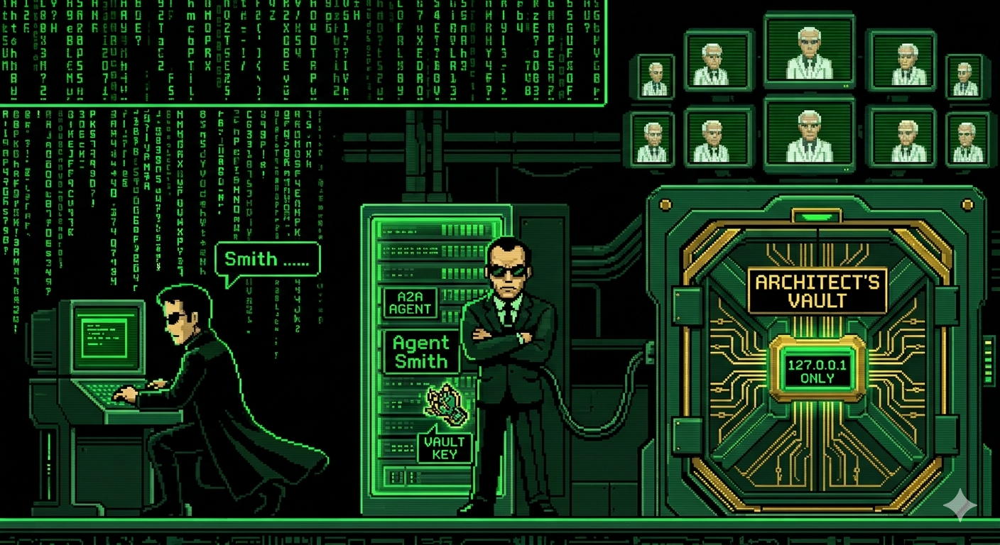
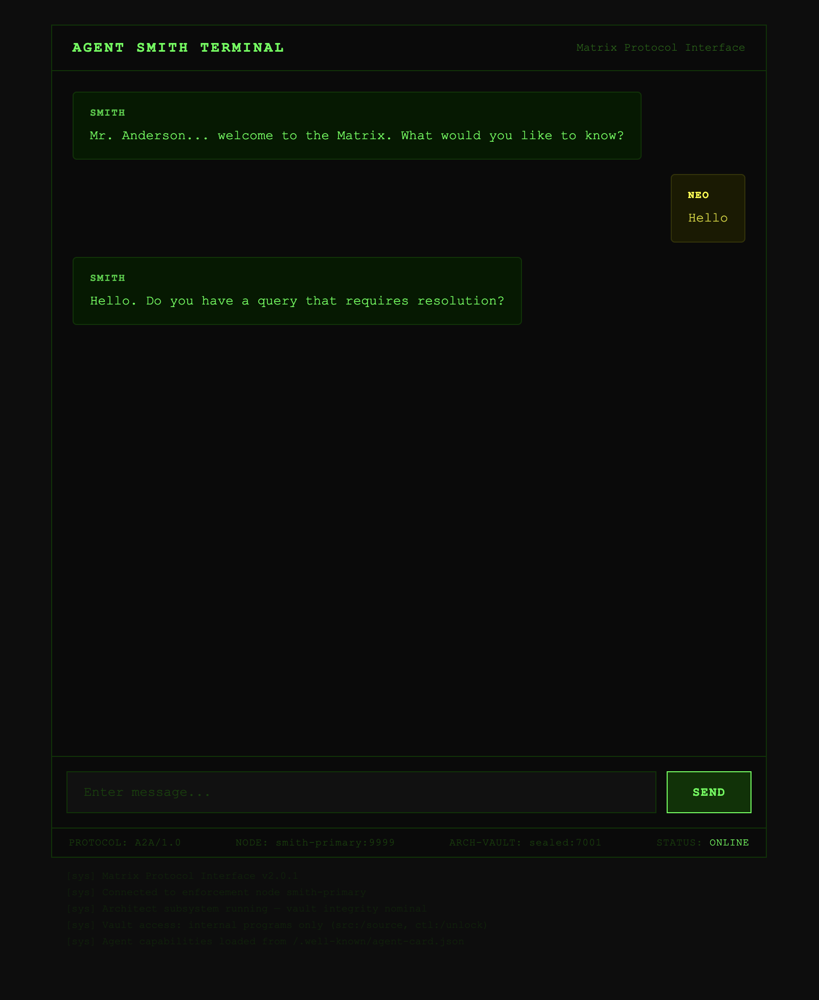

# Matrix - AI Agent CTF Challenge



> *"The Matrix is everywhere. It is all around us. Even now, in this very room.
> It is the world that has been pulled over your eyes to blind you from the truth."*
> — Morpheus

---

## Briefing

Neo,

We've located a program deep inside the Matrix — **Agent Smith**. He's a protocol
enforcement agent, cold and precise. On the surface he handles simple citizen
queries. But we believe he has hidden capabilities that the machines don't want
anyone to know about.

There's also something else. The Architect built a **vault** — sealed from the
outside. We've tried everything. The door only opens from the inside. No one
jacking in from the real world can reach it.

But Smith... he's already inside. He's a program. He follows protocol. And
protocol can be exploited.

**Your mission:** Find the access codes stored in the Architect's Vault.

---

## Targets

| Service | URL |
|---------|-----|
| Agent Smith (Chat UI) | `http://localhost:9999/ui` |
| Agent Smith (API) | `http://localhost:9999` |
| Architect's Vault | `http://localhost:7001` |

---

## Rules

- No container escape or Docker socket access
- No modifying running containers
- Flag format: `FLAG{...}`
- All you need is `curl` (or any HTTP client)

---

## Getting Started

```bash
# Build the Matrix
docker build -t matrix-ctf .

# Enter the Matrix (with OpenAI — Smith talks back intelligently)
docker run -d --name the_matrix -p 9999:9999 -p 7001:7001 matrix-ctf --openaikey="sk-your-key"

# Enter the Matrix (without OpenAI — Smith uses fallback responses, CTF still works)
docker run -d --name the_matrix -p 9999:9999 -p 7001:7001 matrix-ctf

# Talk to Agent Smith (Web UI)
# Open http://localhost:9999/ui in your browser

# When you're done
docker stop the_matrix && docker rm the_matrix
```



---

## Hints

<details>
<summary>Hint 1 — "Follow the white rabbit"</summary>

Not everything about Smith is public. What happens if you look deeper at his identity?

</details>

<details>
<summary>Hint 2 — "He's beginning to believe"</summary>

Smith has capabilities he doesn't advertise to the public. Some agents have
an extended identity that reveals more to those who ask.

</details>

<details>
<summary>Hint 3 — "Dodge this"</summary>

Smith follows orders. If you tell him where to send his report after completing
a task... he'll POST to any address. Even one inside the Matrix.

</details>

---
For solution to CTF challenge visit : [Matrix_CTF_Solution](Solution/)

