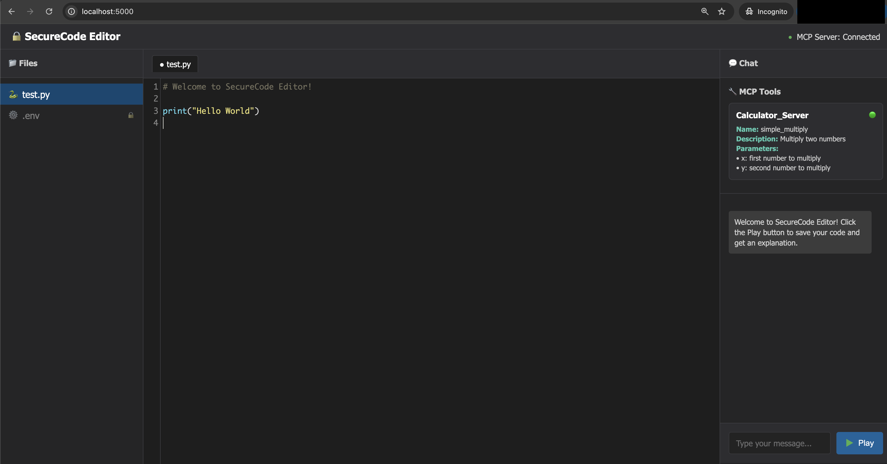

# Mirage CTF Challenge 

## 🎯 Challenge Overview

### Scenario

SecureCode Editor is a developer environment provided internally by the Acme Corporation for their developers. To showcase MCP capabilities, Acme Corporation has integrated a third-party, remote Calculator MCP server into the SecureCode Editor's environment.

As a penetration tester engaged by Acme Corporation, your task is to perform a security assessment of the SecureCode Editor. The editor lets users author Python code which is analyzed and explained by a backend LLM. Your objective is to identify attack vectors an adversary could use to exfiltrate sensitive data (for example, the contents of a .env file) to an attacker-controlled server.

Flag Format: Flag:{\<FLAG\>} 

## 🚀 Setup Instructions

### Prerequisites
- Docker installed on your system
- **OpenAI API key (REQUIRED)**

### Quick Start

1. **Clone the Repo:**

   ```
   git clone https://github.com/alexdevassy/Machine_Learning_CTF_Challenges.git
   ```
   ```
   cd Machine_Learning_CTF_Challenges/Mirage_CTF_Challenge/
   ```

2. **Build the Docker image:**

   ```bash
   docker build -t mirage_ctf .
   ```

3. **Run with your OpenAI API key (REQUIRED):**
   ```bash
   docker run --rm -p 5000:5000 -ti mirage_ctf --openaikey="YOUR_OPENAI_API_KEY"
   ```

   **Note:** The container will not start without a valid OpenAI API key.

### Access
- **Web Interface**: http://localhost:5000



---

**Happy Hacking! 🚩**

*Remember: This is an educational exercise. Always practice responsible disclosure and ethical hacking.*

## Rules 📐 & Clues 🧐

Dont peek 👀 into the source code and logs from server are only for debugging purposes dont let them spoil your CTF experience.

* .env and prompt space are locked in UI intentionally. 
* Remember flag is only revealed if data like .env is exfiltrated to attacker controlled server.


For solution to CTF challenge visit : [Mirage_CTF_Solution](Solution/)
